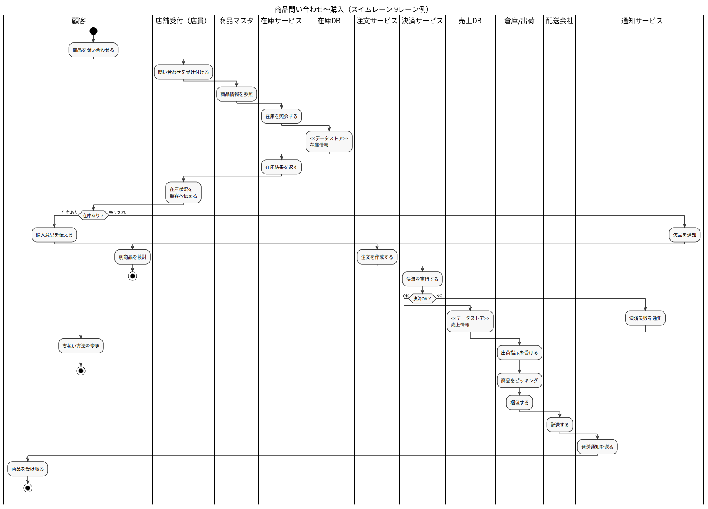

# ログイン機能 設計書

## 概要

本ドキュメントはログイン処理の設計を示す。

---

## アクティビティ図

以下はログイン処理のフローである。

---

## 処理概要

1. ログイン画面を表示する  
2. ユーザーがIDとパスワードを入力  
3. 認証を行う  
4. 成功時はダッシュボードへ遷移  
5. 失敗時はエラー表示して再入力  

---

## 備考

- 図は PlantUML から自動生成される  
- SVG は CI により更新される  
